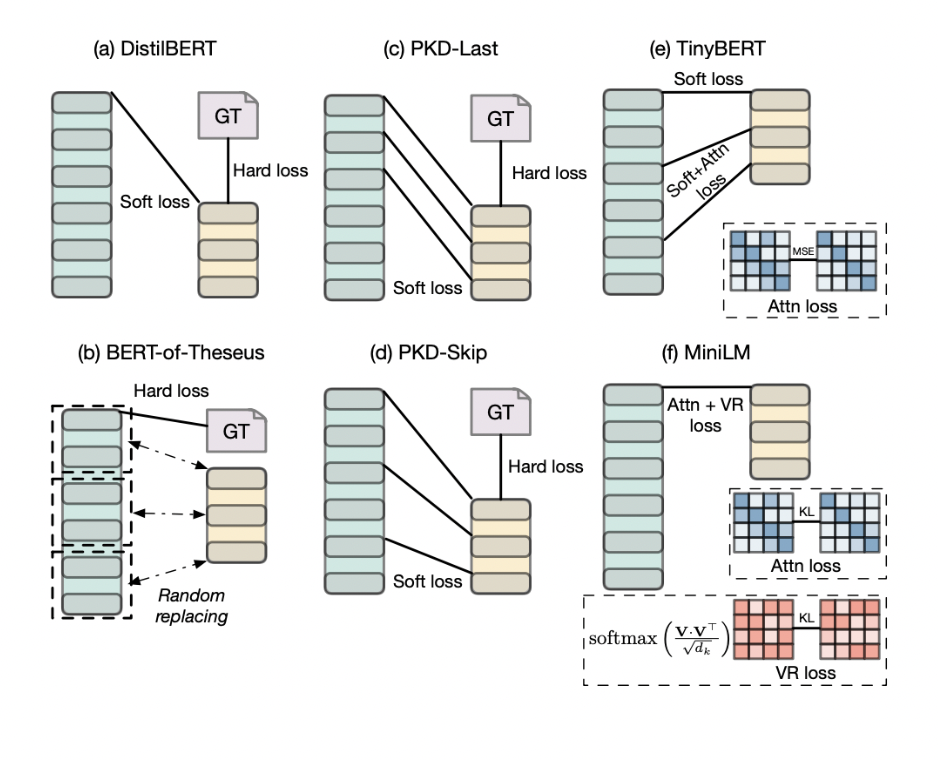
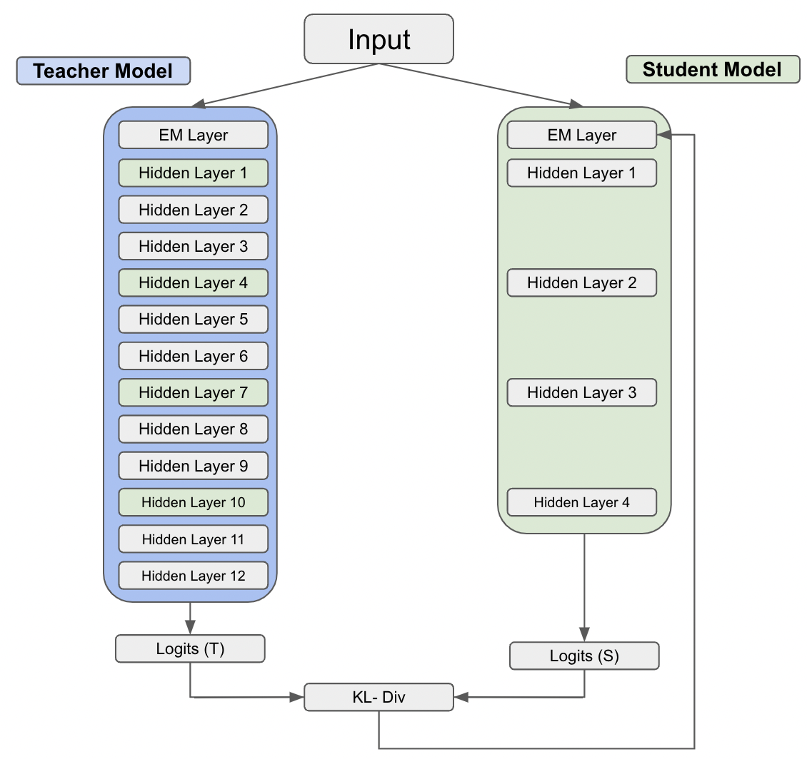
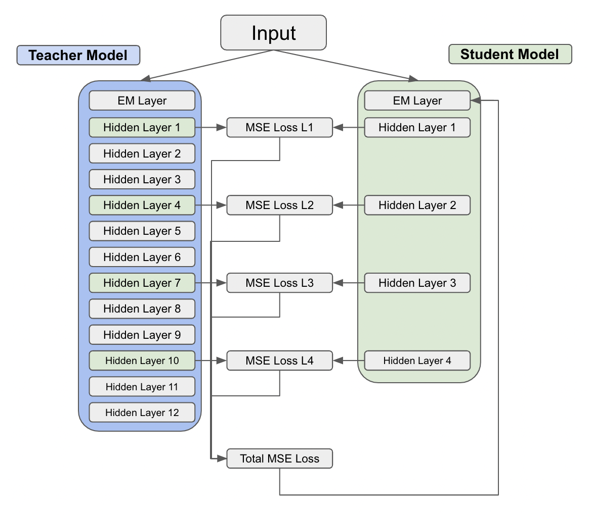
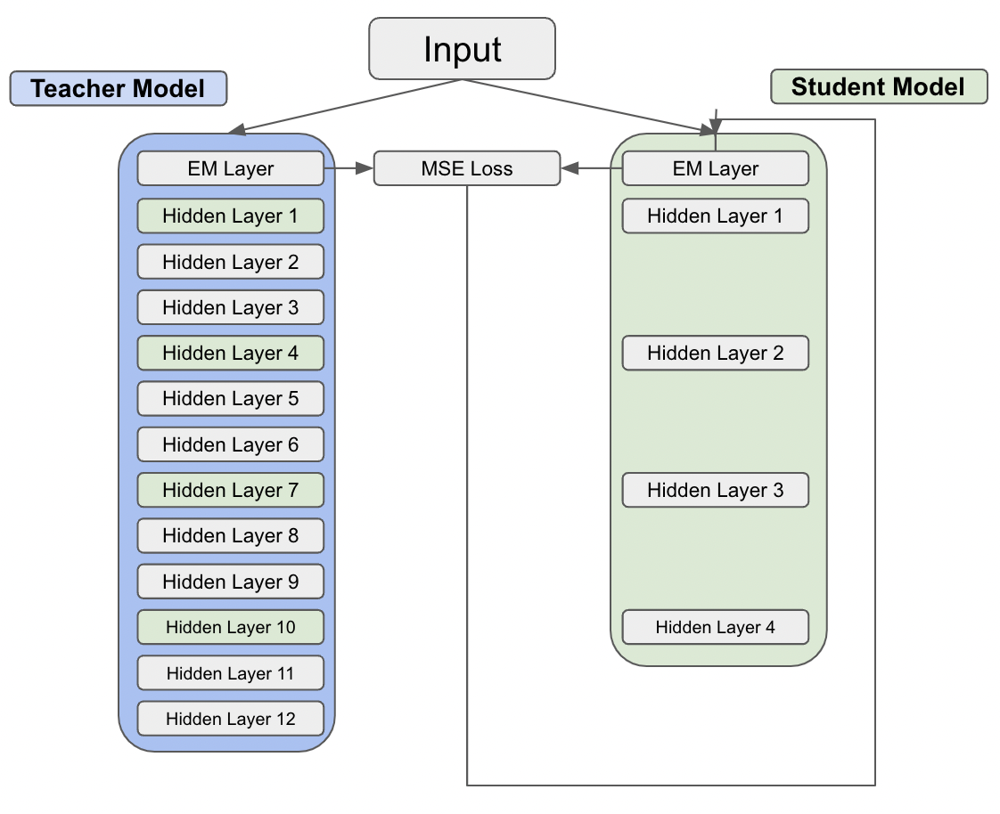
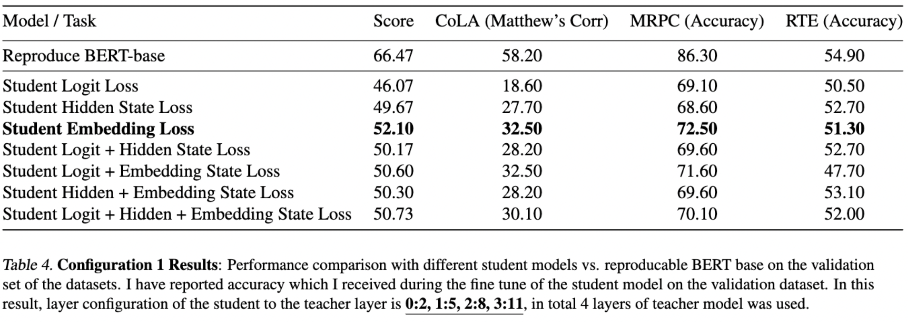
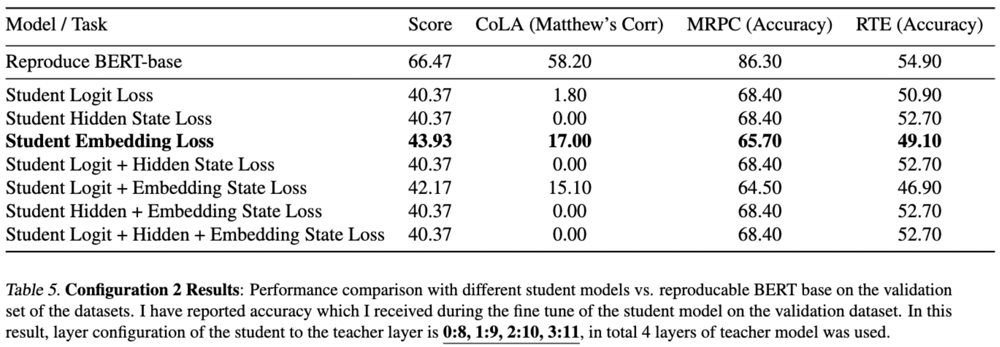
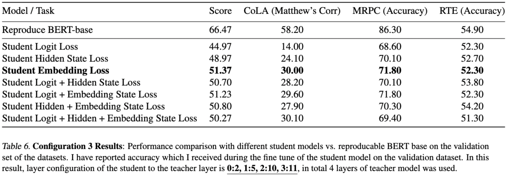
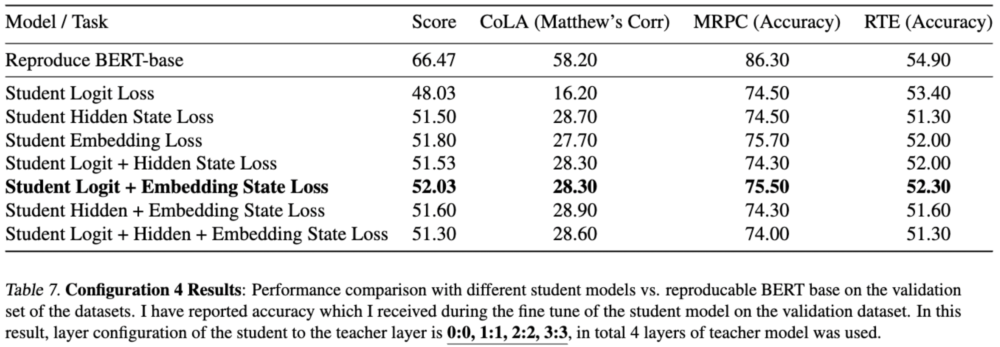

<h1>BERT-Insights</h1>

Table of contents
=================

<!--ts-->

- [Table of contents](#table-of-contents)
- [Introduction](#introduction)
- [Literature Survey](#literature-survey)
      - [DistiBERT](#distibert)
      - [BERT-of-Theseus](#bert-of-theseus)
      - [Patience Knowledge Distillation (PKD)-Last and Skip](#patience-knowledge-distillation-pkd-last-and-skip)
      - [TinyBERT](#tinybert)
      - [MiniLM](#minilm)
- [Installation](#installation)
  - [Setup Environment](#setup-environment)
  - [Install Dependencies](#install-dependencies)
- [Methods](#methods)
  - [Logit-based Loss](#logit-based-loss)
  - [Hidden State Loss](#hidden-state-loss)
  - [Embedding State Loss](#embedding-state-loss)
  - [Other Methods](#other-methods)
- [Results](#results)
- [References](#references)

<!--te-->

# Introduction

There has been a growing trend of developing Large Language Models (LLMs) which are setting up the new state-of-the-art performance and go-to tool for many downstream tasks, particularly in Natural Language Processing [1] [2] [3]. Often these models benefit from their over-parameterized nature and contain millions or billions of parameters, which results in high computational costs and increases memory consumption and latency during inference.

To address this issue, several efficient deep learning techniques have been developed to reduce the model size without significant degradation in performance. These techniques include compression techniques such as quantization, learning techniques such as distillation, automation such as Hyper Parameter Optimization, and efficient architecture such as Neural Architecture Search. These techniques can help in achieving a smaller model size, lower memory consumption, and shorter latency during inference[4].

# Literature Survey

#### DistiBERT

Pre-train setting on the task of masked language modeling (MLM). The loss is a combination of three components: the original MLM loss, cosine distance, and KL divergence. Distillation during pre-training phase.

#### BERT-of-Theseus

Fine-tune a predecessor (teacher) model; new genre of model compression; freeze the teacher modules and train a hybrid model by randomly replacing some modules in the teacher model with successor (student) modules; Loss with the help of cross entropy;

#### Patience Knowledge Distillation (PKD)-Last and Skip

Fine-tune a teacher model; model patiently learns from multiple intermediate layers of the teacher model for incremental knowledge extraction

#### TinyBERT

Pre-training + Fine-tuning distillation;  Transformer-layer distillation consisting of attention based and hidden states based distillation.

#### MiniLM

Scaled dot-product between values in the self-attention module as the new deep self-attention knowledge; distilling the self-attention module of the last Transformer layer of the teacher, which is effective and flexible for the student

  
A Snapshot of various Models

      
      <h6>Image Source: https://arxiv.org/pdf/2202.07105.pdf</h6>
  

# Installation

## Setup Environment

- Git clone the [repository](https://github.com/amandalmia14/hockey-primer-1)
- Make sure Python is installed on the system
- Create a virtual environment / conda environment
- Run `setup-dir.py` it will create the log directory
- Update the cluster details if any on the `sh-gen.py` and run the script which will generate the all possible bash scripts for all the defined configurations.
- Once all the experiments are finished run `get_results.py` to collate all the results.

## Install Dependencies

- Activate the environment and run `pip install -r requirement.txt` this will download all the dependencies related to
  this project.

# Methods

## Logit-based Loss
It involves using the logits, which are the output of the final layer of both models before applying the softmax function. These logits are then scaled to a value known as temperature, which gauges the teacher probabilities and makes them more informative and less confident. The difference in the probability distribution of the teacher and student model is calculated in the form of loss, which is then propagated backward to update the model parameters.

Logit-based Loss

     

## Hidden State Loss
There are 12 hidden layers in the BERT-base model. Based on the student's configuration of layers, the loss of the selected hidden states of both models is calculated using Mean Square Error. The summation of all the layers of MSE Error is then propagated backward to update the model parameters.

Hidden State Loss

## Embedding State Loss
The first layer of BERT is the Encoding layer. The difference in the embedding layer representation of both the student and teacher models was calculated using MSE. The loss is then propagated backward to update the model parameters.

Embedding State Loss

     

## Other Methods
- Logit-based Loss + Hidden State Loss
- Logit-based Loss + Embedding State Loss
- Embedding State Loss + Hidden State Loss
- Logit-based Loss + Hidden State Loss + Embedding State Loss

# Results

The default configuration for the experiment is batch size=64, max len=64, epochs=3. Four different sets of experiments based on various combinations of the layers of the student models have been analyzed to understand the effects of various loss functions such as Logit Loss, Hidden Loss, and Embedding Loss, and their respective combinations. In addition, the importance of various layers during knowledge transfer from the teacher model (BERT-base) to the student model has been investigated. 

From the below tables, it is clear that the knowledge transfer from the last layers of the teacher (BERT-base) model doesn't provides much better results as compared to the alternate / early layers. I have also observed that using the Embedding state loss the knowledge transfer is much more efficient as compared to other loss function. Additionally, using other loss function accompanied with Embedding state loss function also gets better results. 

The following are the four layers of the combination that were used during the analysis.

Configuration 1

     Every third layers of the teacher model (indexing from 0) i.e. {2,5,8,11}
       
     

Configuration 2

     Last 4 layers, i.e. {8,9,10,11}
       
     

Configuration 3

      Third, fifth and last two layers of the teacher model, i.e. {2,5,10,11}
        
     

Configuration 4

     First four layers of the teacher model, i.e. {0,1,2,3}
       
     

# References
<a id="1">[1]</a> 
Tom B. Brown, Benjamin Mann, Nick Ryder and others(2020). 
Language Models are Few-Shot Learners. 
NeurIPS.

<a id="2">[2]</a> 
Jacob Devlin, Ming{-}Wei Chang, Kenton Lee and Kristina Toutanova(2019). 
BERT: Pre-training of Deep Bidirectional Transformers for Language Understanding. 
NAACL-HLT.

<a id="3">[3]</a> 
Colin Raffel, Noam Shazeer, Adam Roberts and others (2020). 
Exploring the Limits of Transfer Learning with a Unified Text-to-Text
J. Mach. Learn. Res.

<a id="4">[4]</a> 
Menghani, Gaurav (2021). 
Efficient Deep Learning: A Survey on Making Deep Learning Models Smaller, Faster, and Better.
arXiv.

<a id="5">[5]</a> 
Ganesh J. 
Tutorial on Distillation for Efficient BERT Models.
[Link](https://github.com/UBC-NLP/dl-nlp-rg/blob/master/tutorial/20221031_distillation_for_bert.ipynb).

And many more.